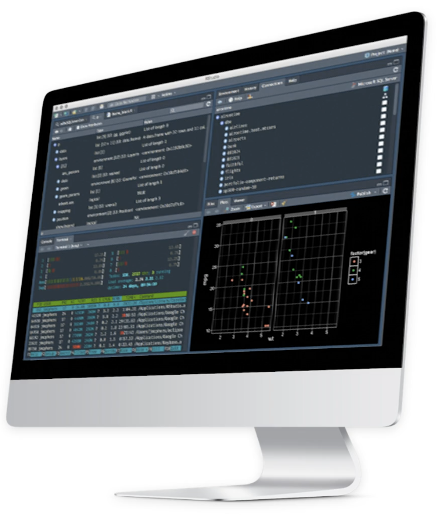
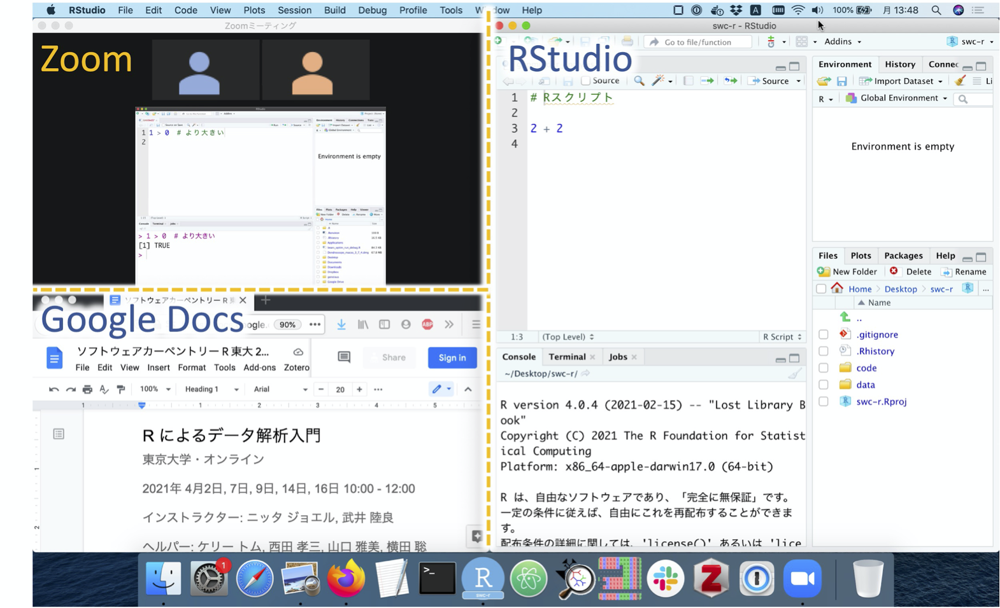
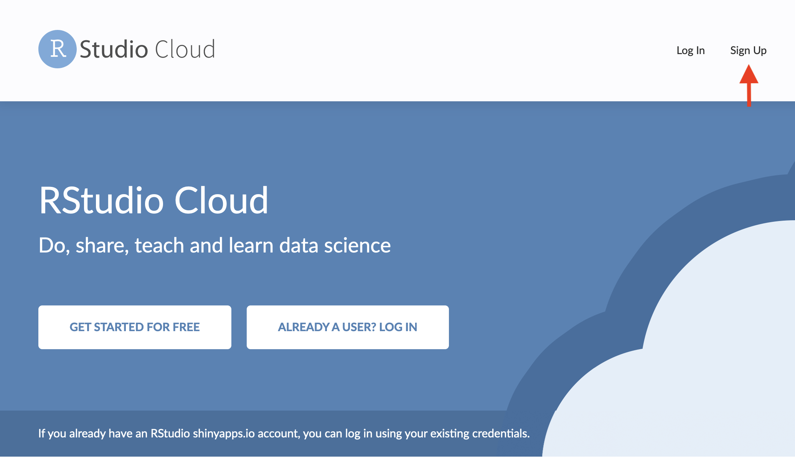
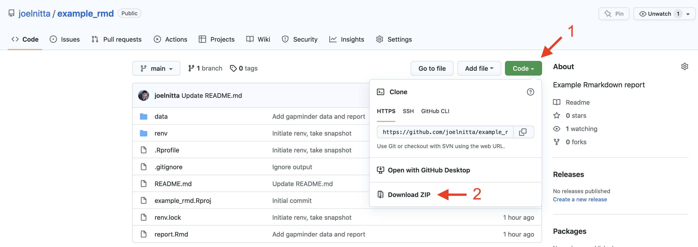
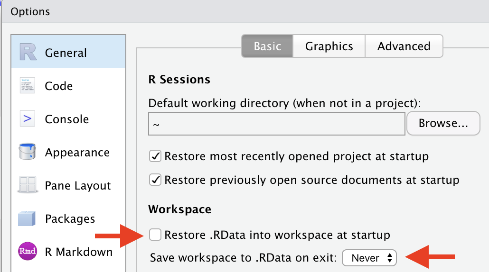

```{r setup, include=FALSE}
options(htmltools.dir.version = FALSE)
knitr::opts_chunk$set(
  fig.width = 9, fig.height = 3.5, fig.retina = 3,
  out.width = "100%",
  cache = FALSE,
  echo = TRUE,
  message = FALSE, 
  warning = FALSE,
  hiline = TRUE
)
library(tidyverse)
```

```{r xaringan-themer, include=FALSE, warning=FALSE}
library(xaringanthemer)
style_duo_accent(
  primary_color = "#1381B0",
  secondary_color = "#FF961C",
  inverse_header_color = "#FFFFFF",
  text_font_size = "1.25rem",
  extra_css = list(
    ".large" = list("font-size" = "120%"),
    ".small" = list("font-size" = "80%")
  )
)
```

# Introduction to R

### https://joelnitta.github.io/seimei-gairon-r-intro/

.large[
生命科学概論

Joel Nitta

2022-05-13
]

<div style="position:relative;">

</div>

---
## 注意点 Important notice (1/2)

- Zoom参加者の名前表⽰は**「学籍番号と⽒名」**とすること

- ホストの先⽣の要請があったら、アンケートに**「学籍番号と⽒名」**を
書き込むこと

- アンケートは速やかに対応すること

- Please make your name in the Zoom system as **"Student ID_Name"**

- When requested, please write your **"Student ID_Name"** in the survey

- Please respond to the survey promptly

---
## 注意点 Important notice (2/2)

- 質問するときには<span style="text-decoration:underline">声をかける</span>か<span style="text-decoration:underline">挙⼿機能で⼿を挙げ</span>、<span style="text-decoration:underline">ビデオをオンに
して名乗り</span>、質問後に**「質問しました︓学籍番号と⽒名」**とチャット
に書き込むこ

- Please <span style="text-decoration:underline">speak directly after unmuting</span>, or use <span style="text-decoration:underline">"Raise-hands
function"</span>, and then turn your video on to make question. After the
question, please write **"I questioned: Student ID_Name"** in the chat
window.

---
## About me

.pull-left[
### Joel Nitta, PhD

- Project Research Associate (特任助教), Iwasaki Lab

- Research Interest: Ecology and evolution of **ferns**

- R user for >8 years, use R everyday for research
]

.pull-right[

<br>
.small[Photo: J-Y Meyer]
]

---
## Goals of this class

.large[
1. To learn **basic usage of R and RStudio**

2. To learn **how to teach yourself** more about R
]

---
background-image: url("https://www.r-project.org/Rlogo.png")
background-position: 80% 30%

## What is R?

- **Free programming language**

--

- Has a **welcoming community of users<br>who help each other**

--

- Includes 1,000s of extensions = **"packages"**

--

- Can be used for data analysis...

--

- and **many, many other tasks**
  - generate reports (Word, HTML, PDF)
  - make websites (this presentation)
  - send or download emails / tweets
  - etc...

---
## Why use R?

(instead of e.g., Excel)

- Can **automate** tasks

- Allows you (and others) to **reproduce** your work

- **Saves time** (once you learn how to use it)

---

## When to NOT use R?

- For **raw data entry**

- In this case, I recommend using Excel, Google Sheets, etc.

- Use R for everything else `r emo::ji("smile")`

---

## What is RStudio?

.pull-left[
- A free program to help you write and run R code

- **Separate** installation from R itself

- **The easiest way to use R**
]

.pull-right[

]


---

## What is live coding?

.pull-left[
- I will demonstrate how to use R on my computer
- **Please do the same thing on your computer**
  - Let me know anytime if you have any questions
<br><br>
- I will ask if you are able to use R like I show you
  - **Please respond using zoom reactions**
<br><br>
- 日本語でオッケーです`r emo::ji("thumbs up")`
]

.pull-right[

]

---

## Recommended screen setup

.center[

]

---

## What if I can't install R and/or RStudio?

.pull-left[
You can use **RStudio Cloud** https://rstudio.cloud/

- Free access to RStudio through your web browser
- Click "Sign Up" to create account
]

.pull-right[

<br>
https://rstudio.cloud/
]

---

## References

- [Notes](https://docs.google.com/document/d/1G11-8sXl5hbb71ky-YmeHpDvPWXkp0Y-Q65V-59-z78/edit#) from ["Introduction to data analysis with R"](https://swcarpentry-ja.github.io/2021-04-02-todai-online-ja/) Software Carpentry Workshop

- [R for Reproducible Scientific Analysis (JA)](https://swcarpentry-ja.github.io/r-novice-gapminder/ja/)

- [R for Reproducible Scientific Analysis (EN)](https://swcarpentry.github.io/r-novice-gapminder/)

---

## References

.pull-left[

<br>
English version is [free online](https://r4ds.had.co.nz/)
]

.pull-left[

<br>
Available on [Amazon](https://www.amazon.co.jp/%E6%94%B9%E8%A8%822%E7%89%88-R%E3%83%A6%E3%83%BC%E3%82%B6%E3%81%AE%E3%81%9F%E3%82%81%E3%81%AERStudio-%E5%AE%9F%E8%B7%B5-%E5%85%A5%E9%96%80%E3%80%9Ctidyverse%E3%81%AB%E3%82%88%E3%82%8B%E3%83%A2%E3%83%80%E3%83%B3%E3%81%AA%E5%88%86%E6%9E%90%E3%83%95%E3%83%AD%E3%83%BC%E3%81%AE%E4%B8%96%E7%95%8C-%E6%9D%BE%E6%9D%91-ebook/dp/B095W5G8KB)
]

---

## Where to ask for help

- Tokyo.R Slack Chat (in Japanese)
  - Go to https://github.com/TokyoR/r-wakalang to join
  - `#r_beginners` channel is good for questions

- AsiaR Slack Chat (mostly in English)
  - Join by clicking: https://bit.ly/join_asiaR_slack

- Tokyo.R meetup
  - https://tokyor.connpass.com/
  - Usually Saturday afternoons
  - Every 1-2 months
  - Usually starts with a beginner's session

---

## Outline

- Introduction 15:10 - 15:20
- Writing reports (demo) 15:20 - 15:30
- How to use RStudio and basic R commands 15:30 - 16:00
- Variables (objects) 16:00 - 16:15

5 min. break (install tidyverse)

- Functions and packages 16:20 - 16:40
- How to get help 16:40 - 17:00
- Projects in RStudio 17:00 - 17:15
- Data loading and dataframes 17:15 - 18:00
- Wrap-up and questions 18:00 - 18:30

---

## Demo: Writing reports with R

- The code used in this demonstration: https://github.com/joelnitta/example_rmd
- **Your goal for learning R**: write a report like this **for a term paper**

You can download the code by clicking on "Code", then "Download ZIP"

.center[

]

---

## How to use RStudio and basic R commands

### Questions

- How to find your way around RStudio?
- How to interact with R?

### Objectives

- Describe the purpose and use of each pane in RStudio
- Locate buttons and options in RStudio
- Use an interactive R session
- Use mathematical and comparison operators

Reference ([JA](https://swcarpentry-ja.github.io/r-novice-gapminder/ja/_episodes/01-rstudio-intro/index.html), [EN](https://swcarpentry.github.io/r-novice-gapminder/01-rstudio-intro/index.html))

---

## How to use RStudio and basic R commands

### Important change to RStudio settings

.pull-left[
Go to "RStudio" -> "Preferences"

Change the following under "General" options, "Basic" tab:
- **Deselect** "Restore .RData into workspace at startup"

- Set "Save workspace to .RData on exit" to **"Never"**
]

.pull-right[
.center[

]
]
---

## Variables (objects)

### Questions

- How does R store information?
- How can we save and access data in an R session?

### Objectives

- Save data to a variable
- Understand what happens if the variable changes

Reference ([JA](https://swcarpentry-ja.github.io/r-novice-gapminder/ja/_episodes/01-rstudio-intro/index.html), [EN](https://swcarpentry.github.io/r-novice-gapminder/01-rstudio-intro/index.html#variables-and-assignment))

---

## Functions and packages

### Questions

- What is a function?
- What is a package?

### Objectives

- Be able to use functions
- Be able to install and load packages

Reference ([JA](https://swcarpentry-ja.github.io/r-novice-gapminder/ja/_episodes/01-rstudio-intro/index.html), [EN](https://swcarpentry.github.io/r-novice-gapminder/01-rstudio-intro/index.html))

---

## How to get help

### Questions

- Where can I find explanations of functions?
- Where can I get help outside of R?

### Objectives

- Be able to look up the documentation for a function
- Be able to ask/search for help outside of R

Reference ([JA](https://swcarpentry-ja.github.io/r-novice-gapminder/ja/_episodes/03-seeking-help/index.html), [EN](https://swcarpentry.github.io/r-novice-gapminder/03-seeking-help/index.html))

---

## Projects in RStudio

### Questions

- How can I manage my projects in R?

### Objectives

- Create self-contained projects in RStudio

Reference ([JA](https://swcarpentry-ja.github.io/r-novice-gapminder/ja/_episodes/02-project-intro/index.html), [EN](https://swcarpentry.github.io/r-novice-gapminder/02-project-intro/index.html))

---

## Data loading and dataframes

### Questions

- How can I load data into R?
- How can I manipulate a data frame?

### Objectives

- Use the `load_` functions to load data
- Be able to subset and change data

Reference ([JA](https://swcarpentry-ja.github.io/r-novice-gapminder/ja/_episodes/05-data-structures-part2/index.html), [EN](https://swcarpentry.github.io/r-novice-gapminder/05-data-structures-part2/index.html))
